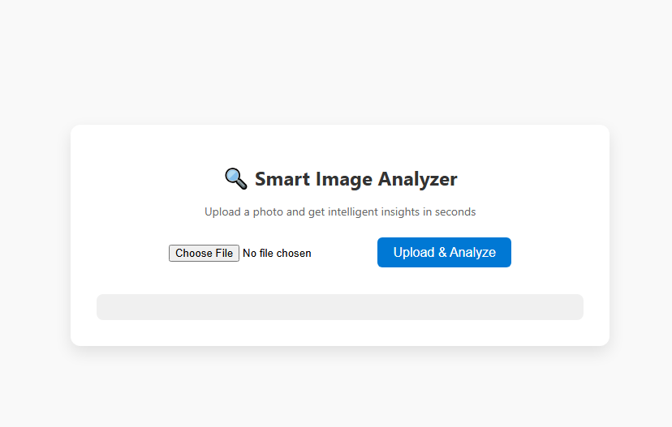

Watch the video walkthrough by clicking on the first diagram at the top

# Image-Analysis-App
A serverless web application to analyze images using AWS Rekognition.

🧠 Image Analyzer App
This is a full-stack serverless web app that allows users to:

✅ Upload an image
✅ Analyze it using AWS Rekognition
✅ Display labels (with 90%+ confidence) detected in the image

It's built with pure HTML/CSS/JavaScript on the frontend, and powered by AWS Lambda, S3, and API Gateway on the backend — all serverless.

🛠 How it works
User uploads an image

Frontend hits the API Gateway, which triggers a Lambda function

Lambda generates a pre-signed S3 URL and returns it

Image is uploaded to S3

Another Lambda function is triggered, which analyzes the image using AWS Rekognition

Results are stored as JSON in another S3 bucket

Frontend polls the result file and shows the detected labels

🧑‍💻 Developer Notes
Frontend is hosted on S3 static website hosting

Backend is fully serverless (2 Lambda functions)

No API keys or sensitive data are exposed in this repo
